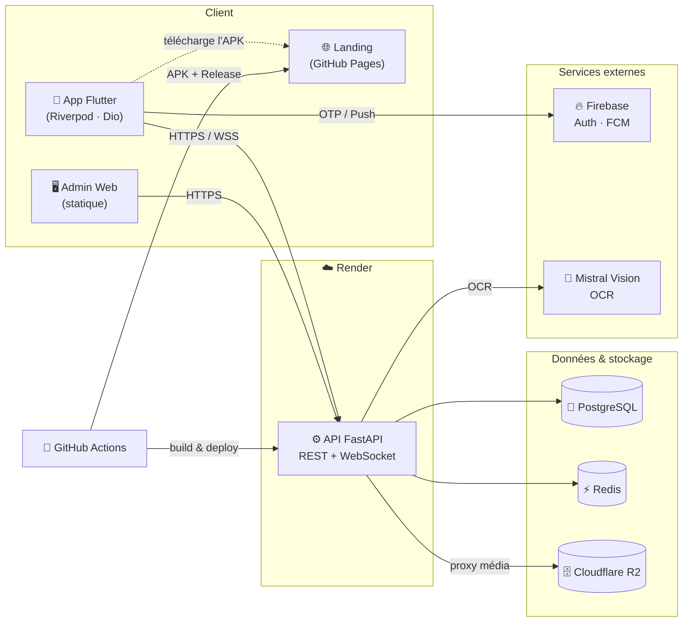

<div align="center">

# ReTurn 🇨🇲

### Retrouver. Restituer. Confiance.

**Plateforme mobile de restitution sécurisée des documents perdus, propulsée par l'IA.**
Quand un document officiel est perdu au Cameroun, ReTurn met en relation — en toute sécurité — la personne qui l'a perdu et celle qui l'a retrouvé.

<br/>

[](https://flutter.dev)
[](https://fastapi.tiangolo.com)
[](https://www.postgresql.org)
[](https://render.com)
[](https://github.com/features/actions)
[](#)
[](#-licence)

**[🌐 Démo & téléchargement](https://itxmveng.github.io/ReTurn/)** · **[📖 API (Swagger)](https://docretour-api.onrender.com/docs)** · **[🩺 Statut backend](https://docretour-api.onrender.com/health)**

</div>

---

## Sommaire

1. [À propos](#-à-propos)
2. [Fonctionnalités clés](#-fonctionnalités-clés)
3. [Stack technique](#-stack-technique)
4. [Architecture](#-architecture)
5. [Structure du monorepo](#-structure-du-monorepo)
6. [Démarrage rapide](#-démarrage-rapide)
7. [Configuration](#-configuration)
8. [CI/CD & déploiement](#-cicd--déploiement)
9. [Aperçu de l'API](#-aperçu-de-lapi)
10. [Sécurité & confidentialité](#-sécurité--confidentialité)
11. [Performance](#-performance)
12. [Roadmap](#-roadmap)
13. [Auteur](#-auteur)
14. [Licence](#-licence)

---

## 🎯 À propos

**Le constat.** Perdre une CNI, un passeport ou un permis au Cameroun, c'est le début d'un parcours administratif long et coûteux. Or dans la majorité des cas, le document *existe toujours* : quelqu'un l'a ramassé mais n'a aucun moyen fiable et sûr de le rendre.

**La solution.** ReTurn est le **pont de confiance** entre les deux. On déclare un document (perdu ou trouvé), une **IA lit et structure** automatiquement les informations, un **algorithme de rapprochement** associe perdu ↔ trouvé, puis une **vérification d'identité** débloque une **messagerie sécurisée** pour organiser la restitution — sans jamais exposer les données personnelles avant confirmation.

> Projet full-stack conçu et développé de bout en bout : application mobile, API, intelligence artificielle appliquée, et industrialisation cloud (CI/CD, déploiement continu, monitoring).

---

## ✨ Fonctionnalités clés

### 🤖 Intelligence artificielle
- **OCR IA** — lecture automatique des documents (imprimé **et** manuscrit) via **Mistral Vision**, avec repli **ML Kit** on-device en cas d'indisponibilité réseau.
- **Rapprochement tolérant** — matching insensible à la casse et aux accents, gérant les noms partiels (« Jean » ↔ « Jean Mbarga »), pondéré et renormalisé sur les signaux réellement disponibles (nom, numéro, géolocalisation, cohérence temporelle).
- **Tri automatique multi-documents** — on scanne plusieurs documents d'un coup, l'app les **regroupe seule par propriétaire détecté** (un dossier = une personne).
- **Redaction intelligente des images** — les photos restent reconnaissables mais les informations personnelles sont **masquées par bandeaux** tant que l'identité n'est pas vérifiée.

### 🔐 Sécurité & confiance
- **Vérification d'identité adaptative** (questions de contrôle → selfie → pièce justificative selon le niveau de risque).
- **Messagerie débloquée uniquement après vérification** — aucun échange possible avant confirmation d'identité.
- **Masquage des données sensibles** jusqu'à confirmation mutuelle (RGPD / droit à l'effacement).
- **Authentification** par OTP SMS (Firebase) ou Google.

### 📱 Expérience produit
- Application **Flutter** cross-platform, **bilingue FR/EN** (langue système par défaut, changement en un tap).
- Restitution guidée (lieu de rendez-vous, double confirmation, évaluation & réputation).
- **Zones certifiées** (commissariat, mairie, campus) pour des remises sécurisées.
- Notifications push (FCM), thème clair/sombre, déverrouillage biométrique.

### 🛠️ Back-office
- **Dashboard admin** web (statique, sans build) : KPIs temps réel, modération, gestion des utilisateurs, zones, signalements et **journaux d'audit**.

---

## 🧱 Stack technique

| Couche | Technologies |
|---|---|
| **Mobile** | Flutter · Riverpod · Freezed · GoRouter · Dio · ML Kit · Firebase Auth/FCM |
| **Backend** | FastAPI · SQLAlchemy (async / asyncpg) · Alembic · Pydantic · WebSockets |
| **Données** | PostgreSQL · Redis |
| **IA / OCR** | Mistral Vision (proxy backend) · Google ML Kit (on-device) |
| **Stockage** | Cloudflare R2 (S3-compatible) via proxy média |
| **Cloud & CI/CD** | Render · GitHub Actions · GitHub Pages · Docker |
| **Auth & Push** | Firebase (Phone Auth, Cloud Messaging) |

---

## 🏗️ Architecture



**Flux principal :** déclaration → OCR IA → rapprochement automatique → vérification d'identité → messagerie sécurisée → restitution guidée & évaluation.

---

## 📁 Structure du monorepo

```
ReTurn/
├── backend/                 # API FastAPI
│   └── app/
│       ├── api/v1/endpoints # auth, declarations, matches, messaging,
│       │                    # profile, restitutions, reports, admin, media, ocr
│       ├── core/            # config, database, sécurité, redis, firebase
│       ├── models/          # SQLAlchemy (user, declaration, match, message…)
│       ├── schemas/         # Pydantic
│       ├── services/        # matching, verification, storage, ocr, notifications
│       └── main.py
├── mobile/                  # Application Flutter
│   └── lib/
│       ├── core/            # network (Dio), router, services, widgets, l10n
│       └── features/        # auth, declarations, matches, messaging, ocr,
│                            # profile, restitution, verification, zones…
├── admin/                   # Dashboard admin web (HTML/JS statique)
├── landing/                 # Landing page (GitHub Pages) + APK
├── infra/                   # docker-compose (Postgres, Redis, MinIO)
├── docs/                    # Cahier des charges, wireframes, docs API
└── .github/workflows/       # CI/CD (backend, mobile, landing, keep-alive)
```

---

## 🚀 Démarrage rapide

### Prérequis
Docker · Python 3.11+ · Flutter 3.x

### 1 · Backend + infrastructure

```bash
# Infrastructure locale (PostgreSQL, Redis, MinIO)
docker compose --env-file infra/.env -f infra/docker-compose.yml up -d

# API
cd backend
pip install -r requirements.txt
alembic upgrade head
uvicorn app.main:app --reload --host 0.0.0.0 --port 8000
```

| Service | URL |
|---|---|
| API FastAPI | `http://localhost:8000` |
| Swagger UI | `http://localhost:8000/docs` |
| Console MinIO | `http://localhost:9001` |

### 2 · Application mobile

```bash
cd mobile
flutter pub get
dart run build_runner build --delete-conflicting-outputs   # génère freezed/json
flutter run \
  --dart-define=API_BASE_URL=http://10.0.2.2:8000 \
  --dart-define=GOOGLE_SERVER_CLIENT_ID=<votre_client_id>
```

### 3 · Dashboard admin

```bash
cd admin && python -m http.server 3000   # → http://localhost:3000
```

> Le déploiement en production (Render + R2 + GitHub Pages) est détaillé dans **[`DEPLOYMENT.md`](DEPLOYMENT.md)**.

---

## ⚙️ Configuration

Toutes les valeurs sensibles passent par des variables d'environnement (jamais dans le code ni dans l'APK).

**Backend** (`infra/.env`)

| Variable | Rôle |
|---|---|
| `DATABASE_URL` | Connexion PostgreSQL (async, `postgresql+asyncpg://…`) |
| `REDIS_URL` | Connexion Redis |
| `SECRET_KEY` | Signature des JWT |
| `MINIO_*` / `R2_*` | Stockage objet (endpoint, clés, bucket) |
| `FIREBASE_SERVICE_ACCOUNT_JSON` | Compte de service Firebase (Auth/FCM) |
| `MISTRAL_API_KEY` | Clé OCR IA (serveur uniquement) |
| `ADMIN_PHONE_NUMBERS` | Numéros promus administrateurs |

**Mobile** (via `--dart-define` / GitHub Secrets)

| Variable | Rôle |
|---|---|
| `API_BASE_URL` | URL de l'API |
| `GOOGLE_SERVER_CLIENT_ID` | Sign-in Google |

---

## 🔄 CI/CD & déploiement

Quatre workflows GitHub Actions industrialisent la livraison :

| Workflow | Déclencheur | Rôle |
|---|---|---|
| **Backend deploy** | push `main` | Déploie l'API sur Render (deploy hook) |
| **Mobile release** | tag `v*` | Build APK (`--split-per-abi`, arm64 léger) + GitHub Release |
| **Landing** | release publiée | Publie la landing + APK sur GitHub Pages (lien anti-cache versionné) |
| **Keep-alive** | cron / 10 min | Ping `/health` pour éviter la mise en veille (free tier) |

**Publier une nouvelle version :** bump du `version` dans `pubspec.yaml`, puis :

```bash
git tag v1.3.1 && git push origin v1.3.1
```

→ build automatique de l'APK, création de la Release, et mise à jour de la page de téléchargement.

---

## 🔌 Aperçu de l'API

Base : `/api/v1` · Documentation interactive : `/docs`

| Domaine | Endpoints principaux |
|---|---|
| **Auth** | `POST /auth/otp/request` · `/auth/otp/verify` · `/auth/refresh` · `/auth/verify-firebase-token` |
| **Profil** | `GET·PATCH /profile/` · `PATCH /profile/avatar` |
| **Déclarations** | `POST·GET /declarations/` · `POST /declarations/batch` (dossier) · `GET·PATCH·DELETE /declarations/{id}` |
| **Matchs** | `GET /matches` · `GET /matches/{id}` · confirmation via vérification |
| **Vérification** | `POST /messaging/{id}/verify/answers` · `submit_selfie` · `submit_doc_photo` |
| **Messagerie** | `GET /messaging/conversations` · `POST /messaging/{id}` · `WS /messaging/{id}/ws` |
| **Restitutions** | `POST /restitutions` · `POST /restitutions/{id}/confirm` · `/rate` |
| **Média** | `GET /media/{bucket}/{path}` (proxy public en lecture) |
| **Admin** | `/admin/stats` · `/admin/users` · `/admin/zones` · `/admin/audit-logs` … |

---

## 🔒 Sécurité & confidentialité

- **Aucune donnée personnelle exposée** avant vérification et confirmation mutuelle (numéros et noms masqués, images redactées).
- **JWT** courts + refresh token avec intercepteur mutex (pas de boucle 401).
- **Secrets côté serveur uniquement** (clé OCR, comptes de service) — jamais embarqués dans l'APK.
- **Messagerie fermée** tant que l'identité n'est pas vérifiée (contrôlé côté REST **et** WebSocket).
- **CORS durci** (y compris sur les erreurs 500) et journaux d'audit des actions admin.
- **RGPD / droit à l'effacement** : suppression définitive du compte et des données.

---

## ⚡ Performance

- **APK léger** — build `--split-per-abi` (arm64) : ~1/3 du poids d'un APK universel.
- **Zéro cold start perçu** — keep-alive qui maintient le backend éveillé (free tier).
- **Images en cache disque** (`cached_network_image`) : chargées une fois, plus de re-téléchargement au scroll.
- **Réseau résilient** — timeouts adaptés et retry sur erreurs transitoires ; refetch propre des données à la connexion.
- **Pagination cursor**, `reconcile_schema` au démarrage (auto-réparation du schéma), Redis pour le cache et le temps réel.

---

## 🗺️ Roadmap

- [x] Auth OTP / Google · profil · déclarations
- [x] OCR IA · rapprochement automatique · vérification d'identité
- [x] Messagerie temps réel · restitution guidée · réputation
- [x] Back-office admin · zones certifiées · audit
- [x] Multi-documents (tri automatique) · dossiers groupés
- [x] i18n FR/EN · redaction images · CI/CD complet
- [ ] Redaction précise pilotée par bounding-boxes serveur
- [ ] Notifications in-app enrichies · statistiques utilisateur
- [ ] Publication sur les stores (Play Store / App Store)

---

## 👤 Auteur

**François Itoua** — élève-ingénieur (5ᵉ année), passionné de Cloud, IA et développement.

[](mailto:francisitoua05@gmail.com)
[](https://github.com/ItxMveng)

> 🎓 À la recherche d'un **stage puis d'un CDI** en Cloud / IA / Développement. N'hésitez pas à tester l'app et à me faire vos retours !

---

## 📄 Licence

Distribué sous licence **MIT**. Voir le fichier `LICENSE` pour plus d'informations.

<div align="center">
<br/>
<sub>Construit avec ❤️ pour le Cameroun · <a href="https://itxmveng.github.io/ReTurn/">itxmveng.github.io/ReTurn</a></sub>
</div>
